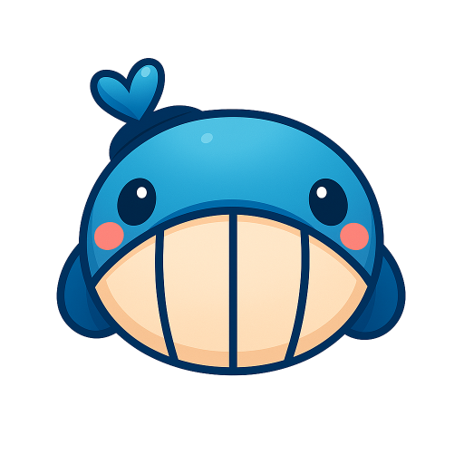

<div align="center">



# KunAvatar

<div class="badges-container">

[](https://ollama.ai/) [](https://opensource.org/licenses/Apache-2.0) 
[](https://mseep.ai/app/fdb0db94-da47-4150-b370-4931a6da9ca4)

</div>

[English](./README_EN.md) | 简体中文

</div>

## ✨ 项目简介

KunAvatar 是一款支持本地部署的轻量级 AI 桌面客户端，以 Ollama 为核心推理引擎构建。该产品在完整保留 Ollama 原生功能的基础上，进一步扩展了多项高实用性能力：涵盖 RBAC 权限体系、多租户管理、对话记忆功能，同时支持 MCP 服务器工具与辅助模型，能够精准匹配对数据隐私性有高要求用户的使用需求，兼顾功能实用性与数据安全性。

### 🎯 核心优势

- **🧠 智能记忆** - 递归式记忆系统，让AI真正"记住"对话内容
- **🎯 模型协作** - 多模型协同工作，主模型专注对话，辅助模型优化体验  
- **🔧 工具生态** - 支持SSE、Streamable HTTP等多种协议的MCP工具集成
- **👥 企业级管理** - 完整的RBAC权限体系，支持多租户和资源级数据管理
- **🚀 本地部署** - 数据完全本地化，保护隐私安全，支持局域网访问
- **📦 开箱即用** - 无需复杂配置，即可在本地部署和使用（目前只支持Windows）

无论是个人使用、团队协作还是企业部署，KunAvatar 都能为您提供专业、安全、智能的AI交互体验。

### 文档地址
- [KunAvatar 文档](https://kunlabai.com/zh/docs)

## 🎯 主要特性

### 🤖 智能对话系统
- **流式对话响应** - 实时显示AI回复，提供流畅的对话体验
- **多模型支持** - 兼容所有 Ollama 模型，支持模型热切换
- **上下文记忆** - 智能记忆管理，保持长对话的连贯性
- **对话历史** - 完整的对话记录和搜索功能
- **多模态支持** - 支持图片进行上下文对话

### 🧠 高级记忆系统
- **智能上下文管理** - 自动分析对话内容，提取关键信息
- **递归式记忆更新** - 动态更新和优化记忆内容
- **记忆优化算法** - 智能压缩和整理历史对话
- **后台记忆服务** - 异步处理记忆生成，不影响对话流畅度
- **全局记忆设置** - 支持用户级别的记忆配置和管理

### 🔧 MCP 工具集成
- **多传输协议支持** - 支持 stdio、SSE、Streamable HTTP 三种连接方式
- **一键连接获取工具** - 自动发现和连接MCP服务器，快速获取可用工具
- **多服务器管理** - 同时管理多个MCP服务器，统一工具调用接口
- **实时工具调用** - 让AI具备执行外部工具的能力
- **工具状态监控** - 实时监控工具连接状态和执行结果
- **工具权限管理** - 细粒度控制工具的访问权限
- **SSE 流式连接** - 支持 Server-Sent Events 实时通信
- **HTTP 流式传输** - 官方推荐的 Streamable HTTP 传输方式
- **STDIO 标准输入输出** - 已集成多款本地STDIO工具

### 🎯 辅助模型系统
- **多模型协作** - 主模型与辅助模型协同工作
- **提示词优化** - 专用模型优化用户输入和系统提示
- **标题摘要生成** - 自动生成对话标题和内容摘要
- **记忆模型** - 支持自定义记忆模型，优化对话效果

### 🧠 智能体系统
- **可配置智能体** - 创建专业领域的AI助手
- **MCP工具自定义** - 为每个智能体定制专属的工具列表
- **系统提示词管理** - 灵活的提示词配置和优化
- **智能体记忆关联** - 每个智能体拥有独立的记忆系统

### 👥 企业级用户管理
- **资源级别数据管理** - 支持用户、角色、权限的细粒度管理
- **RBAC 权限控制** - 基于角色的访问控制系统
- **企业级模块** - 支持多租户、数据隔离、权限审计
- **用户状态管理** - 支持用户激活、暂停、禁用等状态控制
- **角色权限分配** - 灵活的角色创建和权限分配机制
- **数据安全隔离** - 确保不同用户数据完全隔离

## 🛠️ 技术栈

### 前端技术
- **Next.js 15** - React 全栈框架，支持 App Router
- **React 19** - 最新的 React 版本，提供更好的性能
- **TypeScript** - 类型安全的 JavaScript 超集
- **Tailwind CSS** - 实用优先的 CSS 框架
- **Framer Motion** - 强大的动画库
- **three.js** - 3D 图形库

### 后端技术
- **Next.js API Routes** - 服务端 API 实现
- **SQLite3** - 轻量级数据库，支持 Better-SQLite3
- **JWT** - JSON Web Token 认证
- **bcryptjs** - 密码加密

### AI 集成
- **Ollama** - 本地大语言模型运行时
- **MCP (Model Context Protocol)** - 工具调用协议

## 🚀 快速开始

### 环境要求

- **Node.js** >= 22.15.0+
- **npm** >= 11.3.0+
- **Ollama** >= 0.9.6+ (推荐)

### 安装步骤

1. **克隆项目**
```bash
git clone https://github.com/KunLabAI/kun-avatar.git
cd kun-avatar
```

2. **安装依赖**
```bash
npm run install
```

3. **构建项目**
```bash
npm run build
```

4. **启动应用**
```bash
npx start
```

### 启动开发模式

如果需要手动启动，可以使用：

```bash
cd kunavatar
npx next dev
```
如果需要脚本一键启动，可以使用：

```bash
node start.js
```

应用将自动：
- 🔍 检测本机IP地址
- 🌐 配置局域网访问
- 🚀 启动开发服务器
- 📱 在浏览器中打开应用


## 📖 使用指南

### 首次配置

1. **安装 Ollama**
   - 访问 [Ollama 官网](https://ollama.ai/) 下载安装
   - 拉取您需要的模型：`ollama pull gemma3`

2. **创建管理员账户**

选择一：命令执行创建管理员账户
```bash
cd kunavatar/scripts
node init-admin.js
```

选择二：页面创建管理员账户
Note: 应用启动后，访问 http://localhost:3000/register 页面创建管理员账户

### 基本使用

1. **开始对话**
   - 选择AI模型
   - 选择智能体（可选）
   - 开始与AI对话

2. **管理对话**
   - 查看对话历史
   - 搜索历史消息
   - 导出对话记录

3. **配置智能体**
   - 创建专业领域的AI助手
   - 设置系统提示词
   - 配置模型参数

## 📁 项目结构

```
Kun-Avatar/
├── 📄 start.js                    # 智能启动脚本
├── 📄 package.json                # 启动器配置
├── 📁 kunavatar/                  # 主应用目录
│   ├── 📁 src/                    # 源代码
│   │   ├── 📁 app/                # Next.js 页面和API
│   │   │   ├── 📁 api/            # API 路由
│   │   │   │   ├── 📁 chat/       # 聊天相关API
│   │   │   │   ├── 📁 models/     # 模型管理API
│   │   │   │   ├── 📁 mcp/        # MCP工具API
│   │   │   │   └── 📁 auth/       # 认证API
│   │   │   ├── 📁 simple-chat/    # 聊天界面
│   │   │   ├── 📁 model-manager/  # 模型管理
│   │   │   ├── 📁 mcp-config/     # MCP配置
│   │   │   └── 📁 agents/         # 智能体管理
│   │   ├── 📁 components/         # 共享组件
│   │   ├── 📁 lib/                # 核心库
│   │   │   ├── 📁 database/       # 数据库操作
│   │   │   ├── 📁 mcp/            # MCP客户端
│   │   │   ├── 📄 ollama.ts       # Ollama API
│   │   │   └── 📄 auth.ts         # 认证服务
│   │   ├── 📁 hooks/              # React Hooks
│   │   └── 📁 types/              # TypeScript 类型
│   ├── 📁 scripts/                # 工具脚本
│   ├── 📁 public/                 # 静态资源
│   └── 📄 package.json            # 应用依赖
```

## 🚀 后续计划

我们正在积极开发更多激动人心的功能，以下是我们的发展路线图：

### 📋 近期计划

#### 🧠 记忆系统优化
- **智能上下文压缩** - 实现更高效的对话上下文压缩算法
- **记忆层级管理** - 支持短期、中期、长期记忆的分层存储
- **记忆检索优化** - 提升记忆检索的准确性和速度
- **记忆可视化** - 提供记忆内容的可视化管理界面

#### 🔄 模型管理增强
- **一键拉取模型** - 直接从 Ollama 官方仓库拉取和安装模型
- **模型版本管理** - 支持模型版本控制和回滚功能

#### 💻 桌面客户端支持
- **Windows 客户端** - 原生 Windows 桌面应用程序
- **macOS 客户端** - 原生 macOS 桌面应用程序  
- **Linux 客户端** - 支持主流 Linux 发行版
- **跨平台同步** - 桌面端与Web端数据实时同步
- **离线模式** - 支持完全离线的AI对话功能

#### 🌐 多语言支持
- **多语言模型支持** - 支持更多语言模型和翻译功能
- **多语言界面** - 提供多语言用户界面和交互

### 💡 贡献想法

我们欢迎社区贡献想法和建议！如果您有好的想法或功能需求，请：

- 📝 在 [Issues](https://github.com/KunLabAI/kun-avatar/issues) 中提交功能请求
- 💬 在 [Discussions](https://github.com/KunLabAI/kun-avatar/discussions) 中参与讨论
- 🔧 提交 Pull Request 贡献代码

---

## 🤝 贡献指南

我们欢迎所有形式的贡献！无论是bug报告、功能建议还是代码贡献。

### 如何贡献

1. **Fork 项目**
2. **创建功能分支** (`git checkout -b feature/AmazingFeature`)
3. **提交更改** (`git commit -m 'Add some AmazingFeature'`)
4. **推送到分支** (`git push origin feature/AmazingFeature`)
5. **创建 Pull Request**

### 开发指南

- 遵循现有的代码风格
- 添加适当的测试
- 更新相关文档
- 确保所有测试通过

## 📄 许可证

本项目采用 Apache 2.0 许可证 - 查看 [LICENSE](LICENSE) 文件了解详情。

## 🙏 致谢

- [Ollama](https://ollama.ai/) - 提供本地AI模型运行时
- [Next.js](https://nextjs.org/) - 强大的React框架
- [Model Context Protocol](https://modelcontextprotocol.io/) - 工具调用协议标准
- 所有贡献者和用户的支持

[](https://mseep.ai/app/kunlabai-kunavatar)

## 📞 联系我们

- **项目主页**: [GitHub Repository](https://github.com/KunLabAI/kun-avatar)
- **问题反馈**: [Issues](https://github.com/KunLabAI/kun-avatar/issues)
- **功能建议**: [Discussions](https://github.com/KunLabAI/kun-avatar/discussions)
- **联系邮箱**: [info@kunpuai.com](mailto:info@kunpuai.com)

---

<div align="center">

**如果这个项目对您有帮助，请给我们一个 ⭐️**

Made with ❤️ by KunLab Team

</div>
