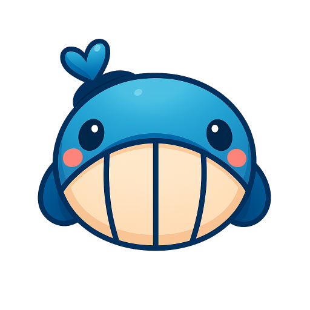

<div align="center">



# KunAvatar

<div class="badges-container">

[](https://ollama.ai/) [](https://opensource.org/licenses/Apache-2.0) 
</div>

English | [简体中文](./README.md)

</div>

## ✨ Project Overview

KunAvatar is a lightweight AI desktop client supporting local deployment, built with Ollama as its core inference engine. While fully retaining Ollama's native functionalities, the client further expands with a range of highly practical capabilities, including an RBAC permission system, multi-tenant management, and conversation memory functionality. It also supports MCP server tools and auxiliary models, accurately catering to the needs of users with high data privacy requirements while balancing functional practicality and data security.

### 🎯 Core Advantages

- **🧠 Intelligent Memory** - Recursive memory system that allows AI to truly "remember" conversation content
- **🎯 Model Collaboration** - Multi-model collaborative work, main model focuses on conversation, auxiliary models optimize experience
- **🔧 Tool Ecosystem** - MCP tool integration supporting multiple protocols like SSE, Streamable HTTP
- **👥 Enterprise Management** - Complete RBAC permission system, supporting multi-tenancy and resource-level data management
- **🚀 Local Deployment** - Completely localized data, protecting privacy and security, supporting LAN access
- **📦 Out-of-the-box** - No complex configuration required, can be deployed and used locally out of the box(Currently only Windows is supported)

Whether for personal use, team collaboration, or enterprise deployment, KunAvatar provides professional, secure, and intelligent AI interaction experience.

###  Documentation

- [KunAvatar Documentation](https://kunlabai.com/zh/docs)

## 🎯 Main Features

### 🤖 Intelligent Conversation System
- **Streaming Response** - Real-time AI reply display for smooth conversation experience
- **Multi-Model Support** - Compatible with all Ollama models, supporting hot model switching
- **Context Memory** - Intelligent memory management, maintaining coherence in long conversations
- **Conversation History** - Complete conversation records and search functionality

### 🧠 Advanced Memory System
- **Intelligent Context Management** - Automatically analyze conversation content and extract key information
- **Recursive Memory Updates** - Dynamically update and optimize memory content
- **Memory Optimization Algorithm** - Intelligently compress and organize historical conversations
- **Background Memory Service** - Asynchronous memory generation without affecting conversation fluency
- **Global Memory Settings** - Support user-level memory configuration and management

### 🔧 MCP Tool Integration
- **Multi-Transport Protocol Support** - Support stdio, SSE, Streamable HTTP three connection methods
- **One-Click Tool Discovery** - Automatically discover and connect MCP servers, quickly obtain available tools
- **Multi-Server Management** - Simultaneously manage multiple MCP servers with unified tool calling interface
- **Real-Time Tool Calling** - Enable AI to execute external tools
- **Tool Status Monitoring** - Real-time monitoring of tool connection status and execution results
- **Tool Permission Management** - Fine-grained control of tool access permissions
- **SSE Streaming Connection** - Support Server-Sent Events real-time communication
- **HTTP Streaming Transport** - Officially recommended Streamable HTTP transport method
- **STDIO Standard I/O** - Integrated multiple local STDIO tools

### 🎯 Auxiliary Model System
- **Multi-Model Collaboration** - Main model and auxiliary models work together
- **Prompt Optimization** - Dedicated models optimize user input and system prompts
- **Title Summary Generation** - Automatically generate conversation titles and content summaries
- **Memory Model** - Support custom memory models to optimize conversation effects

### 🧠 Agent System
- **Configurable Agents** - Create professional domain AI assistants
- **MCP Tool Customization** - Customize exclusive tool lists for each agent
- **System Prompt Management** - Flexible prompt configuration and optimization
- **Agent Memory Association** - Each agent has an independent memory system

### 👥 Enterprise-Level User Management
- **Resource-Level Data Management** - Support fine-grained management of users, roles, and permissions
- **RBAC Permission Control** - Role-based access control system
- **Enterprise Modules** - Support multi-tenancy, data isolation, permission auditing
- **User Status Management** - Support user activation, suspension, disable status control
- **Role Permission Assignment** - Flexible role creation and permission assignment mechanism
- **Data Security Isolation** - Ensure complete isolation of different user data

## 🛠️ Tech Stack

### Frontend Technologies
- **Next.js 15** - React full-stack framework with App Router support
- **React 19** - Latest React version with better performance
- **TypeScript** - Type-safe JavaScript superset
- **Tailwind CSS** - Utility-first CSS framework
- **Framer Motion** - Powerful animation library
- **three.js** - 3D graphics library

### Backend Technologies
- **Next.js API Routes** - Server-side API implementation
- **SQLite3** - Lightweight database with Better-SQLite3 support
- **JWT** - JSON Web Token authentication
- **bcryptjs** - Password encryption

### AI Integration
- **Ollama** - Local large language model runtime
- **MCP (Model Context Protocol)** - Tool calling protocol

## 🚀 Quick Start

### Requirements

- **Node.js** >= 22.15.0+
- **npm** >= 11.3.0+
- **Ollama** >= 0.9.6+ (Recommended)

### Installation Steps

1. **Clone the project**
```bash
git clone https://github.com/KunLabAI/kun-avatar.git
cd kun-avatar
```

2. **Install dependencies**
```bash
npm run install
```

3. **Build the project**
```bash
npm run build
```

4. **Start the application**
```bash
npx start
```

### Development Mode

For manual startup, use:

```bash
cd kunavatar
npx next dev
```

For script one-click startup, use:

```bash
node start.js
```

The application will automatically:
- 🔍 Detect local IP address
- 🌐 Configure LAN access
- 🚀 Start development server
- 📱 Open application in browser

## 📖 User Guide

### Initial Configuration

1. **Install Ollama**
   - Visit [Ollama Official Website](https://ollama.ai/) to download and install
   - Pull the models you need: `ollama pull gemma3`

2. **Create admin account**
Option 1: Command execution to create an administrator account
```bash
cd kunavatar/scripts
node init-admin.js
```

Option 2: Create an administrator account on the page
Note: After the application starts, visit the http://localhost:3000/register page to create the administrator account.

### Basic Usage

1. **Start Conversation**
   - Select AI model
   - Select agent (optional)
   - Start conversation with AI

2. **Manage Conversations**
   - View conversation history
   - Search historical messages
   - Export conversation records

3. **Configure Agents**
   - Create professional domain AI assistants
   - Set system prompts
   - Configure model parameters

## 📁 Project Structure

```
Kun-Avatar/
├── 📄 start.js                    # Smart startup script
├── 📄 package.json                # Launcher configuration
├── 📁 kunavatar/                  # Main application directory
│   ├── 📁 src/                    # Source code
│   │   ├── 📁 app/                # Next.js pages and API
│   │   │   ├── 📁 api/            # API routes
│   │   │   │   ├── 📁 chat/       # Chat-related API
│   │   │   │   ├── 📁 models/     # Model management API
│   │   │   │   ├── 📁 mcp/        # MCP tool API
│   │   │   │   └── 📁 auth/       # Authentication API
│   │   │   ├── 📁 simple-chat/    # Chat interface
│   │   │   ├── 📁 model-manager/  # Model management
│   │   │   ├── 📁 mcp-config/     # MCP configuration
│   │   │   └── 📁 agents/         # Agent management
│   │   ├── 📁 components/         # Shared components
│   │   ├── 📁 lib/                # Core libraries
│   │   │   ├── 📁 database/       # Database operations
│   │   │   ├── 📁 mcp/            # MCP client
│   │   │   ├── 📄 ollama.ts       # Ollama API
│   │   │   └── 📄 auth.ts         # Authentication service
│   │   ├── 📁 hooks/              # React Hooks
│   │   └── 📁 types/              # TypeScript types
│   ├── 📁 scripts/                # Utility scripts
│   ├── 📁 public/                 # Static assets
│   └── 📄 package.json            # Application dependencies
```

## 🚀 Roadmap

We are actively developing more exciting features. Here's our development roadmap:

### 📋 Near-Term Plans

#### 🧠 Memory System Optimization
- **Intelligent Context Compression** - Implement more efficient conversation context compression algorithms
- **Memory Hierarchical Management** - Support layered storage of short-term, medium-term, and long-term memory
- **Memory Retrieval Optimization** - Improve accuracy and speed of memory retrieval
- **Memory Visualization** - Provide visual management interface for memory content

#### 🔄 Model Management Enhancement
- **One-Click Model Pull** - Directly pull and install models from Ollama official repository
- **Model Version Management** - Support model version control and rollback functionality

#### 💻 Desktop Client Support
- **Windows Client** - Native Windows desktop application
- **macOS Client** - Native macOS desktop application
- **Linux Client** - Support mainstream Linux distributions
- **Cross-Platform Sync** - Real-time data synchronization between desktop and web
- **Offline Mode** - Support completely offline AI conversation functionality

#### 🌐 Multi-Language Support
- **Multi-Language Model Support** - Support more language models and translation features
- **Multi-Language Interface** - Provide multi-language user interface and interaction

### 💡 Contributing Ideas

We welcome community ideas and suggestions! If you have good ideas or feature requests, please:

- 📝 Submit feature requests in [Issues](https://github.com/KunLabAI/kun-avatar/issues)
- 💬 Participate in discussions in [Discussions](https://github.com/KunLabAI/kun-avatar/discussions)
- 🔧 Submit Pull Requests to contribute code

---

## 🤝 Contributing

We welcome all forms of contributions! Whether bug reports, feature suggestions, or code contributions.

### How to Contribute

1. **Fork the project**
2. **Create feature branch** (`git checkout -b feature/AmazingFeature`)
3. **Commit changes** (`git commit -m 'Add some AmazingFeature'`)
4. **Push to branch** (`git push origin feature/AmazingFeature`)
5. **Create Pull Request**

### Development Guidelines

- Follow existing code style
- Add appropriate tests
- Update relevant documentation
- Ensure all tests pass

## 📄 License

This project is licensed under the Apache 2.0 License - see the [LICENSE](LICENSE) file for details.

## 🙏 Acknowledgments

- [Ollama](https://ollama.ai/) - Providing local AI model runtime
- [Next.js](https://nextjs.org/) - Powerful React framework
- [Model Context Protocol](https://modelcontextprotocol.io/) - Tool calling protocol standard
- All contributors and users for their support

[](https://mseep.ai/app/kunlabai-kunavatar)

## 📞 Contact Us

- **Project Homepage**: [GitHub Repository](https://github.com/KunLabAI/kun-avatar)
- **Issue Reports**: [Issues](https://github.com/KunLabAI/kun-avatar/issues)
- **Feature Suggestions**: [Discussions](https://github.com/KunLabAI/kun-avatar/discussions)
- **Contact Email**: [info@kunpuai.com](mailto:info@kunpuai.com)

---

<div align="center">

**If this project helps you, please give us a ⭐️**

Made with ❤️ by KunLab Team


</div>
